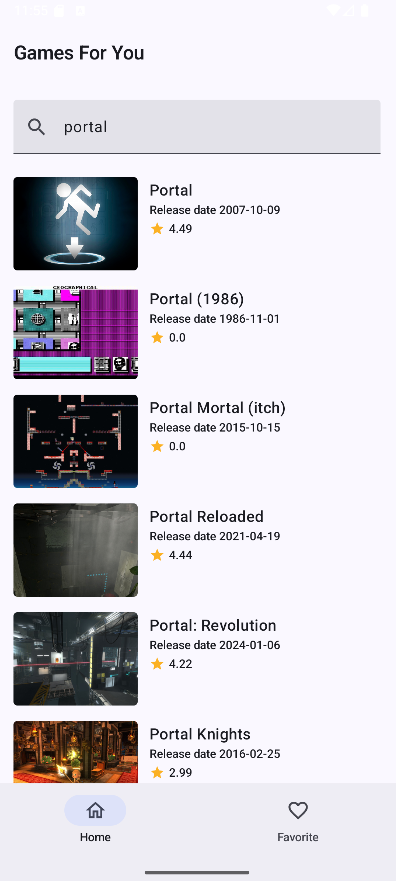
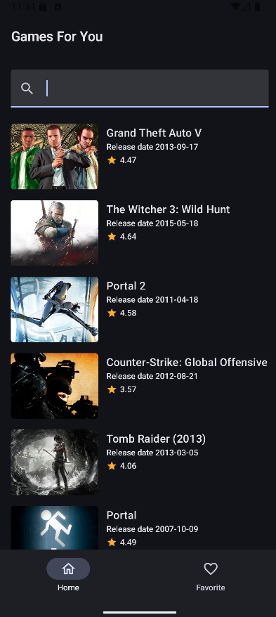
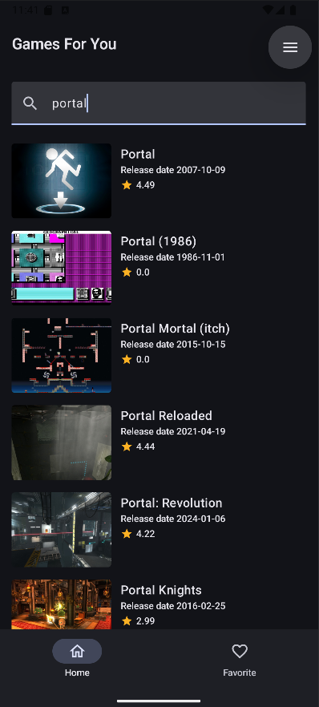
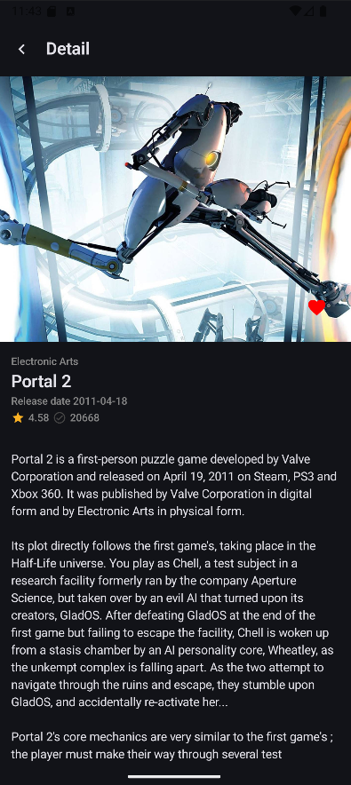
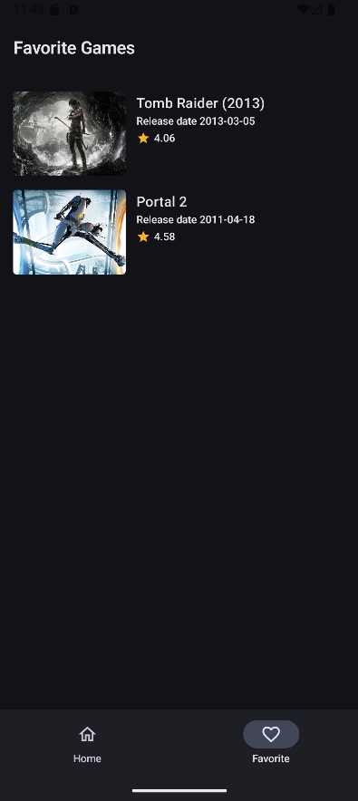

# RawrGames

## Overview

This project is a preview application showcasing a list of games from **RAWG Games** using the [RAWG Open API](https://rawg.io/apidocs).  
It is developed using **Android Jetpack Compose** and follows the principles of **Clean Architecture** for maintainability and scalability.

## Tech Stack

This application is built using the following technologies:

+ **Networking**: OkHttp, Retrofit, and Kotlin Coroutines for asynchronous network requests
+ **Local Database**: Room for data persistence
+ **Dependency Injection**: Dagger Hilt for managing dependencies
+ **User Interface**: Jetpack Compose for modern, declarative UI development

## Preview

